### Part 1. Настройка **gitlab-runner**

##### Поднимаем виртуальную машину *Ubuntu Server 22.04 LTS*.

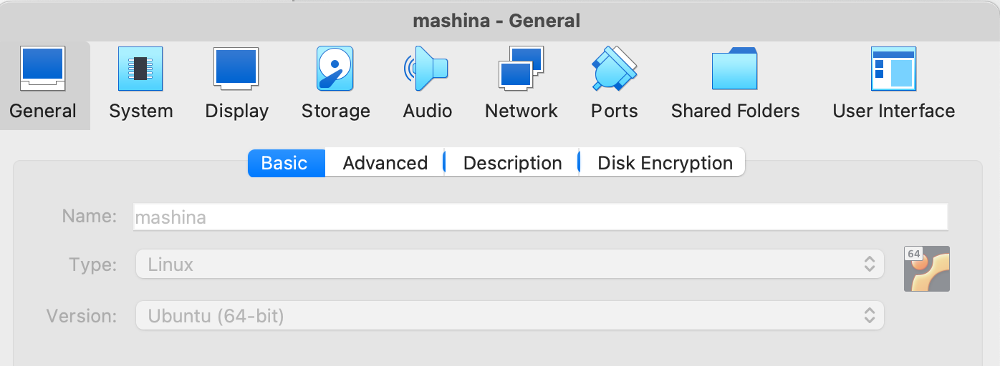

##### Скачиваем и устанавливаем на виртуальную машину **gitlab-runner**.

Выполняем это действие с помощью следующих команд:
* sudo curl -L --output /usr/local/bin/gitlab-runner "https://gitlab-runner-downloads.s3.amazonaws.com/latest/binaries/gitlab-runner-linux-amd64"

* sudo chmod +x /usr/local/bin/gitlab-runner

* sudo useradd --comment 'GitLab Runner' --create-home gitlab-runner --shell /bin/bash

* sudo gitlab-runner install --user=gitlab-runner --working-directory=/home/gitlab-runner

* sudo gitlab-runner start

* sudo systemctl enable --now gitlab-runner

##### Запускаем **gitlab-runner** и регистрируем его для использования в текущем проекте (*DO6_CICD*).
- Для регистрации понадобятся URL и токен

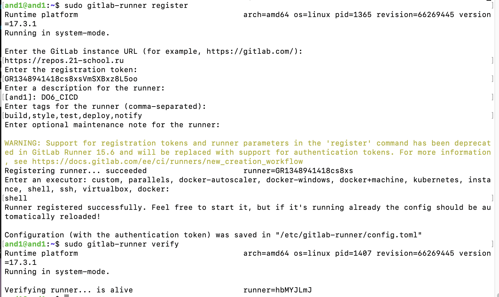

### Part 2. Сборка

#### Напишем этап для **CI** по сборке приложений из проекта *C2_SimpleBashUtils*.

##### В файле _gitlab-ci.yml_ добавляем этап запуска сборки через мейк файл из проекта _C2_.

##### Файлы, полученные после сборки (артефакты), сохраняем в произвольную директорию со сроком хранения 30 дней.


* stages - этот раздел определяет последовательность этапов (stages), которые будут выполняться в CI/CD пайплайне.

* build-job - определение задачи (job), которая будет выполняться в пайплайне. build-job — имя этой задачи. Может быть задано любое имя, которое имеет смысл в контексте проекта.

* stage: build - эта строка указывает, что задача build-job принадлежит этапу build. Поскольку в пайплайне есть только один этап build, эта задача будет выполнена в этом этапе.

* tags - теги используются для указания, на каких Runner-ах должна выполняться эта задача. В данном примере указан тег build, что означает, что задача будет запущена только на Runner-ах, которые настроены с этим тегом. Теги полезны, когда есть разные Runner-ы для различных целей, например, для выполнения задач на разных операционных системах, с различными наборами инструментов или на машинах с разными уровнями доступа.

* script - раздел script содержит команды, которые будут выполнены в задаче. Эти команды выполняются в том же порядке, в каком они записаны.
В данном случае:
    * cd src/cat: переходит в директорию src/cat.
    * make s21_cat: запускает команду make s21_cat для сборки проекта или компиляции программы в этой директории.
    * cd ../grep/: возвращается на уровень вверх и заходит в директорию grep.
    * make s21_grep: запускает команду make s21_grep для сборки проекта или компиляции программы в директории grep.

* artifacts - раздел, который определяет, какие файлы или директории будут сохранены после выполнения задачи и переданы на следующие этапы или доступны для скачивания.
    * paths - указывает пути к файлам или директориям, которые нужно сохранить как артефакты. В данном случае сохраняются содержимое директорий src/cat/ и src/grep/.
    * expire_in - задает срок действия артефактов, после которого они будут автоматически удалены из GitLab. В данном случае артефакты сохраняются на 30 дней. Это значит, что через 30 дней после создания эти артефакты будут удалены, если их не скачать или не использовать.

* stages: определяет этапы выполнения пайплайна.
* job (задача): набор инструкций, которые будут выполняться на определенном этапе.
* tags: указывают, на каких Runner-ах будет выполняться задача.
* script: команды, которые выполняются в задаче.
* artifacts: файлы и директории, которые сохраняются после выполнения задачи и доступны для последующего использования.

Проверяем сбилдился ли проект в гитлабе

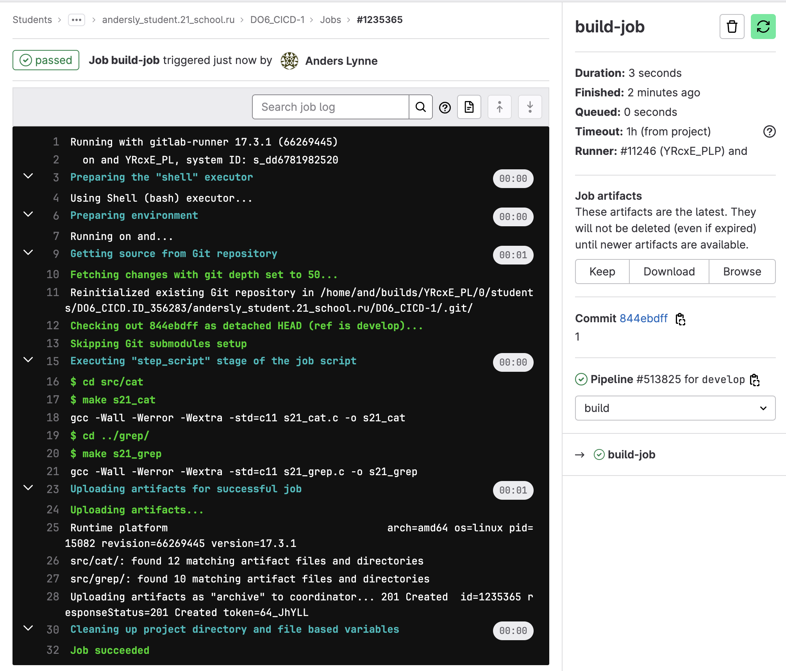

### Part 3. Тест кодстайла


Устанавливаем утилиту для кодстайла (clang-format): 
* ``sudo apt-get update`` 
* ``sudo apt-get install -y git clang-format build-essential findutils``

#### Напишем этап для **CI**, который запускает скрипт кодстайла (*clang-format*).

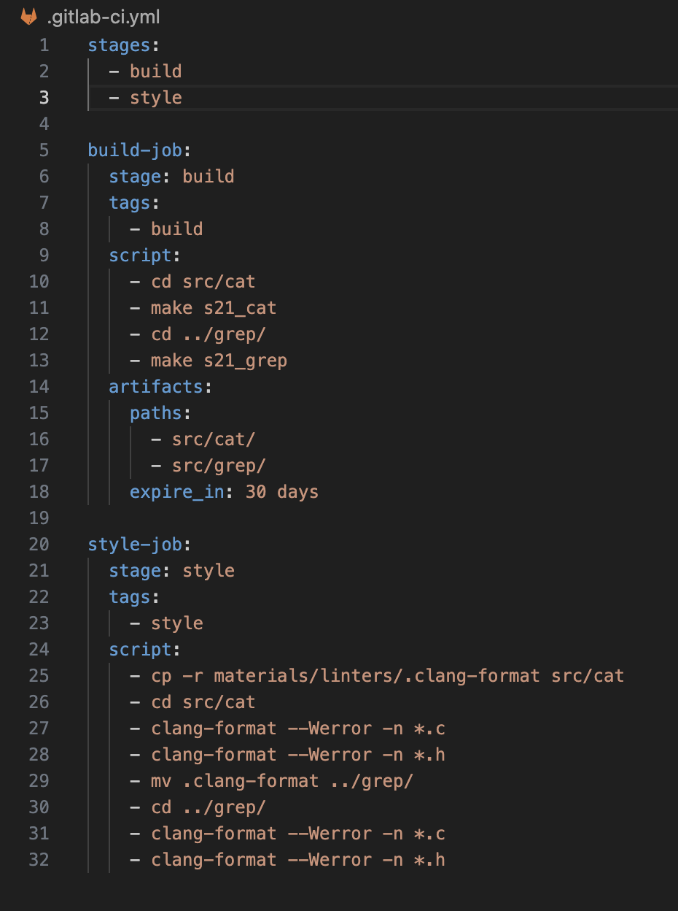

##### В пайплайне отображаем вывод утилиты *clang-format*.

Проверяем, что все работает правильно

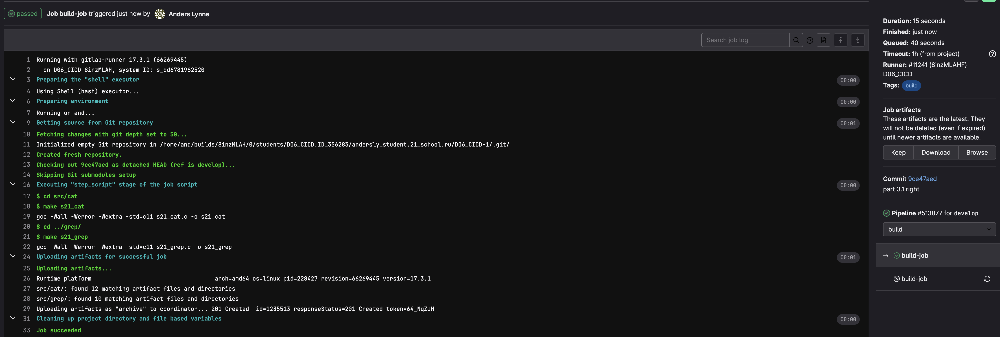
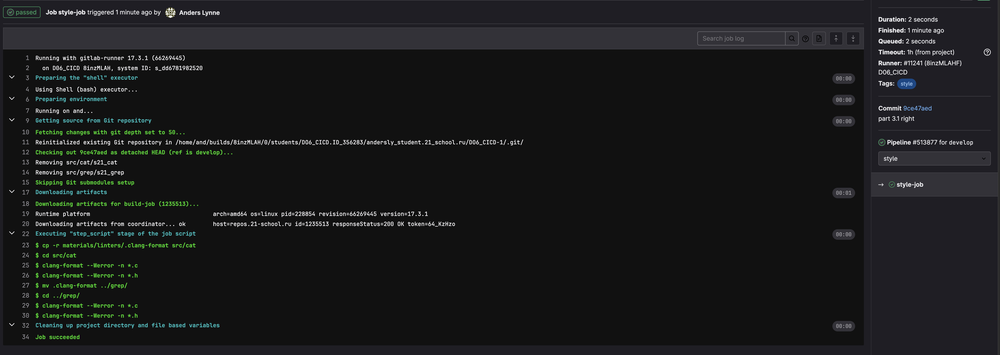

Добавляем ошибки в код стайл, чтобы убедиться, что они обнаружаться

Сбилдилось успешно, однако код стайл ожидаемо не прошел

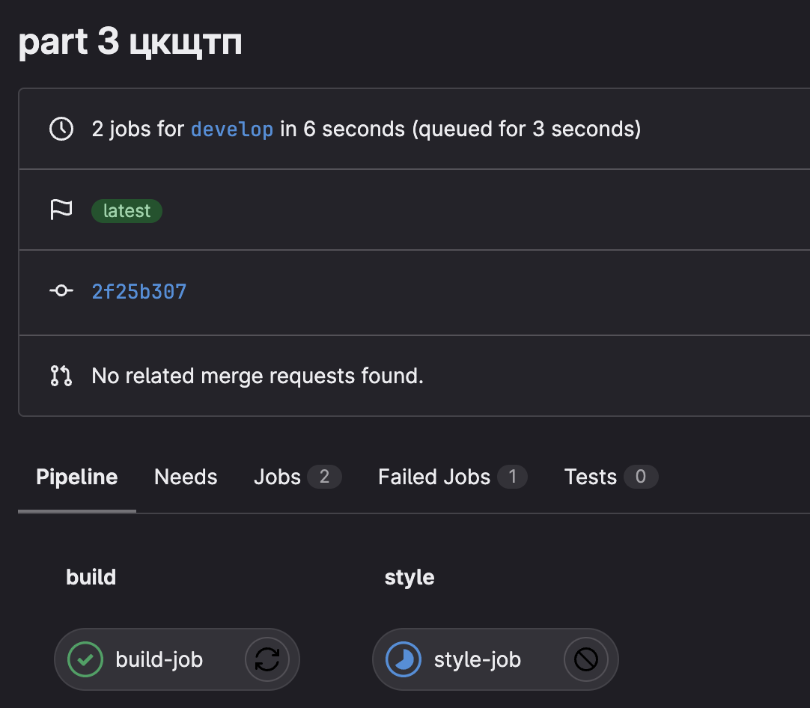
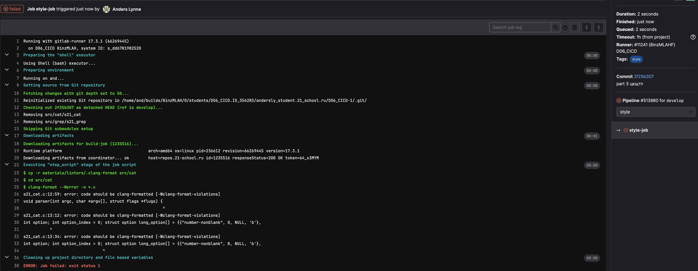

### Part 4. Интеграционные тесты


#### Напишем этап для **CI**, который запускает твои интеграционные тесты из того же проекта.

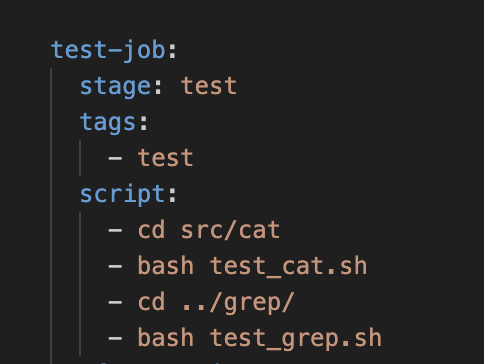

##### Запускаем этот этап автоматически только при условии, если сборка и тест кодстайла прошли успешно.

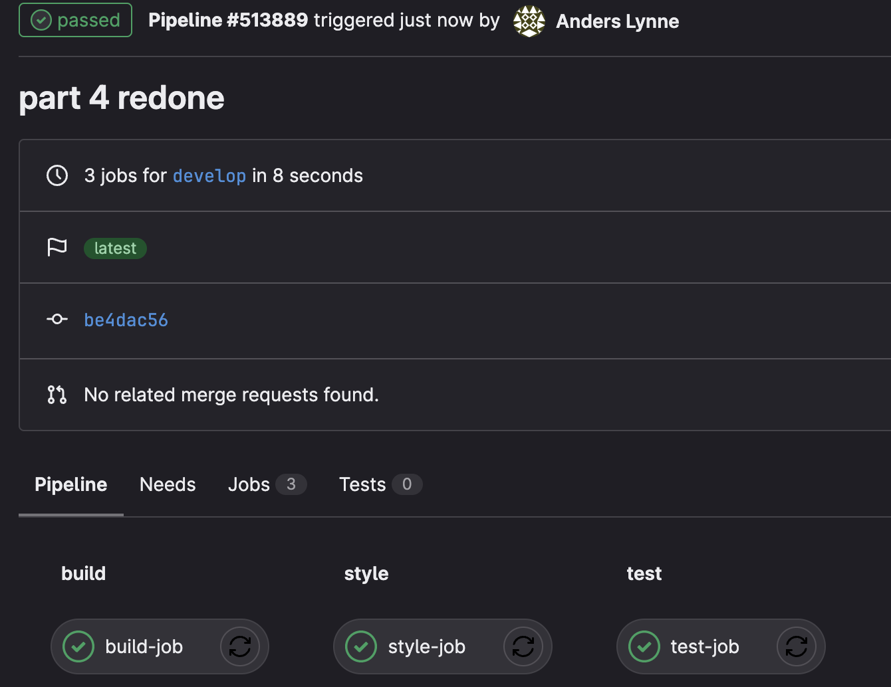

##### В пайплайне отображаем вывод, что интеграционные тесты успешно прошли / провалились.

Специально завалим тесты, чтобы проверить, что  test-job не прошел

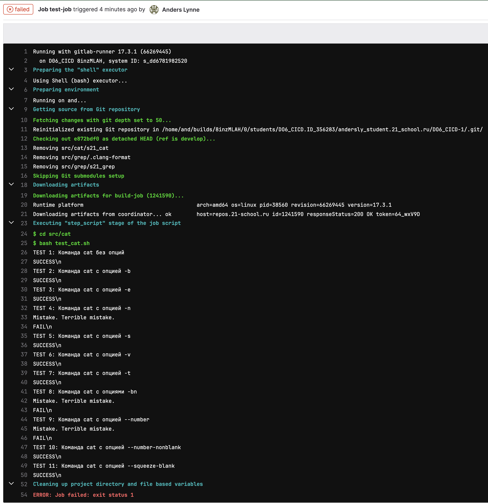

Исправим и проверим, что всё работает

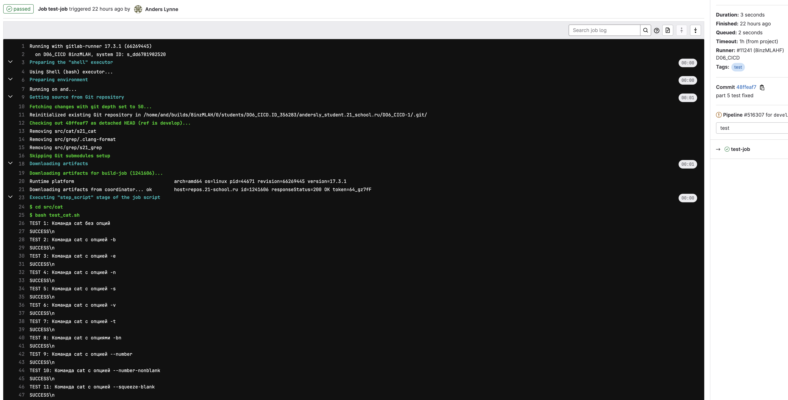
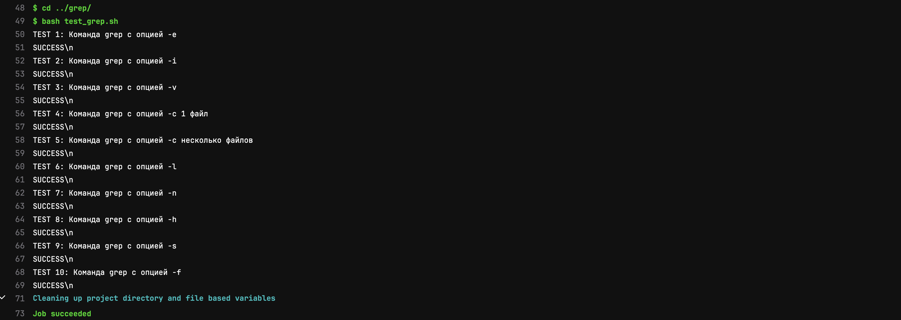

### Part 5. Этап деплоя

Для этого этапа переносим исполняемые файлы на другую виртуальную машину, которая будет играть роль продакшна.

Этап деплоя (или развертывания) — это процесс перемещения и установки приложения или его компонентов в рабочей (продакшн) среде, где приложение будет доступно конечным пользователям. В контексте вашего проекта SimpleBashUtils, деплой означает перенести исполняемые файлы, которые были созданы в результате сборки и тестирования, на другую виртуальную машину, предназначенную для выполнения роли продакшн-сервера (сервер, на котором размещено приложение или веб-сайт, готовое к использованию конечными пользователями в реальной среде).

##### Поднимаем вторую виртуальную машину *Ubuntu Server 22.04 LTS*.

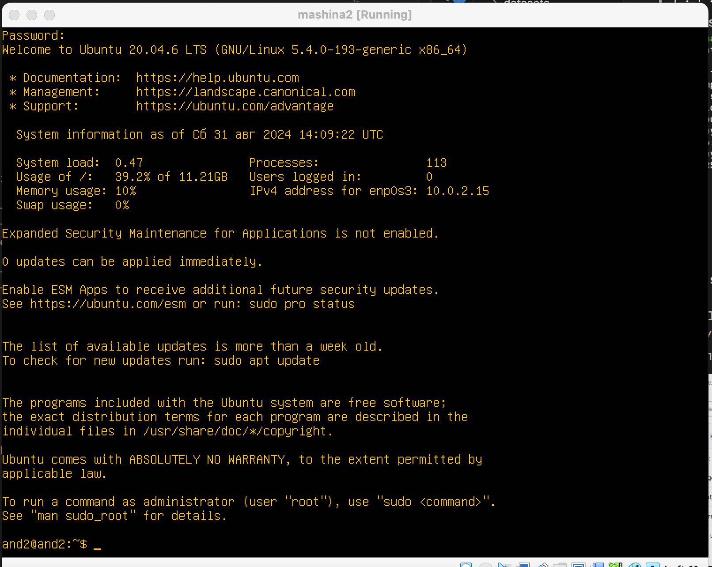

* Статическая маршрутизация между двумя машинами.
Статическая маршрутизация между двумя машинами нужна для обеспечения их взаимной доступности и корректного обмена данными, особенно если они находятся в разных сетях или подсетях.

- Настроим адаптеры обоих машин на внутреннюю сеть: `sudo nano /etc/netplan/00-installer-config.yaml` 
* и cохраним: `sudo netplan apply`

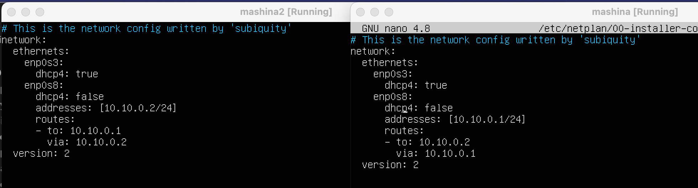

* Изменим настройки адаптеров на обеих машинах и настроим второй адаптер на внутреннюю сеть

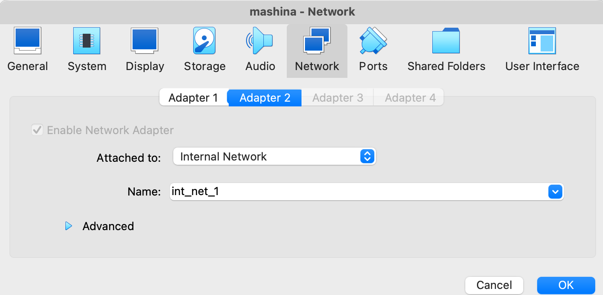

* Проверим соединение между машинами

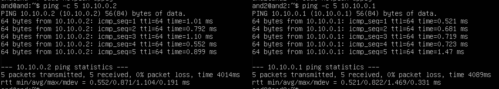

* Генерация ssh-ключей
Для начала сгенерируем пары ключей для каждой машины через команду: ssh-keygen -->

<!-- 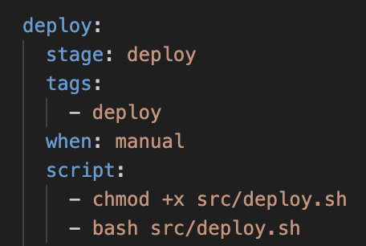 -->

<!-- * Добавим открытый ключ второй машины с вывода cat /home/and2/.ssh/id_rsa.pub в ssh ключи gitlab для работы с проектом на удаленной машине

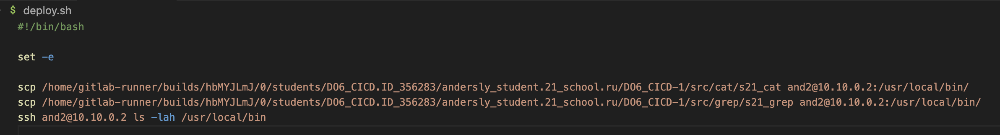 -->

#### Напишем этап для **CD**, который «разворачивает» проект на другой виртуальной машине.


##### Запускаем этот этап вручную при условии, что все предыдущие этапы прошли успешно.

Делам это с помощью указания: `when: manual`

##### Напишем bash-скрипт, который при помощи **ssh** и **scp** копирует файлы, полученные после сборки (артефакты), в директорию */usr/local/bin* второй виртуальной машины.

`scp` (Secure Copy) — это команда для безопасного копирования файлов между локальной и удаленной машинами по протоколу SSH. Она обеспечивает шифрование передаваемых данных, что делает процесс безопасным.


Как происходит перенос?

Сначала мы хотим разрешить первой машине использовать команды без запроса пароля у второй машины. Делаем это следующим образом:
- `sudo su - gitlab-runner` (почему с gitlab-runner? Все артефакты лежат там и это является нашей рабочей директорией)

- `ssh-keygen -t rsa -b 2048`.  -t: Этот параметр определяет тип генерируемого ключа. В данном случае он используется для указания алгоритма, который будет использоваться для получения ключа. rsa: Это тип генерируемого ключа, которым является RSA (Rivest-Shamir-Adleman). RSA - это широко используемый алгоритм шифрования с открытым ключом. 

- `ssh-copy-id and2@10.10.0.2` (username of the 2nd machine and its address). 

Как работает команда ssh-copy-id и как она соединяет машины? 
Команда ssh-copy-id используется для копирования локального открытого ключа SSH на удаленный сервер и настройки удаленного сервера на принятие ключа для аутентификации.

При запуске ssh-copy-id user2@10.10.0.2 команда выполняет следующие действия:

- Ищет локальный открытый ключ SSH в расположении по умолчанию, обычно ~/.ssh/id_rsa.pub.
- Подключается к удаленному серверу с помощью SSH и копирует открытый ключ на удаленный сервер.
- Добавляет открытый ключ к файлу ~/.ssh/authorized_keys удаленного сервера.
- Устанавливает правильные разрешения для каталога ~/.ssh и файла authorized_keys.

В результате удаленный сервер теперь настроен на прием локального SSH-ключа для аутентификации, что позволяет вам входить на удаленный сервер без пароля.

Чтобы команда scp успешно скопировала файлы в папку /usr/local/bin/, нам нужно дать доступ. Для этого мы выполняем следующие действия:
- `sudo su`: переходим в режим root пользователя
- `groupadd name_of_group`: создаем группу пользователей special_users
- `usermod -aG special_users and2`. 

`usermod`: Это команда для изменения учетной записи пользователя. 

`-aG` = "append to group"`, добавляет пользователя в указанную группу, не удаляя его из текущих групп.

`special_users`: название группы, в которую будет добавлен пользователь.
`and2`: имя пользователя учетной записи, которая будет изменена.

Итог: параметр -aG добавляет пользователя and2 в группу special_users.

- `chown root:special_users /usr/local/bin`. Это означает, что пользователь root будет иметь полный контроль над каталогом и его содержимым, а группа special_users будет иметь доступ на групповом уровне.

- `chmod 770 /usr/local/bin`. 7 (owner permissions): root имеет права на чтение, запись и выполнение (rwx) в каталоге. 7 (group permissions): группа special_users имеет права на чтение, запись и выполнение (rwx) в каталоге. 0 (other permissions): другие пользователи (не входящие в группу special_users) не имеют разрешений (---) на доступ к каталогу.

- `ls -ld /usr/local/bin`: проверяем, что разрешения даны верно.

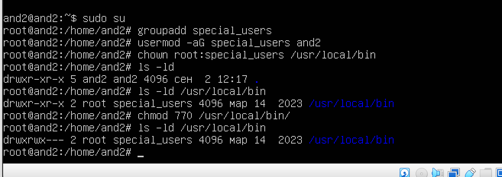

Пушим изменения, запускаем раннер и проверяем, что этап деплоя проходит верно и вручную.

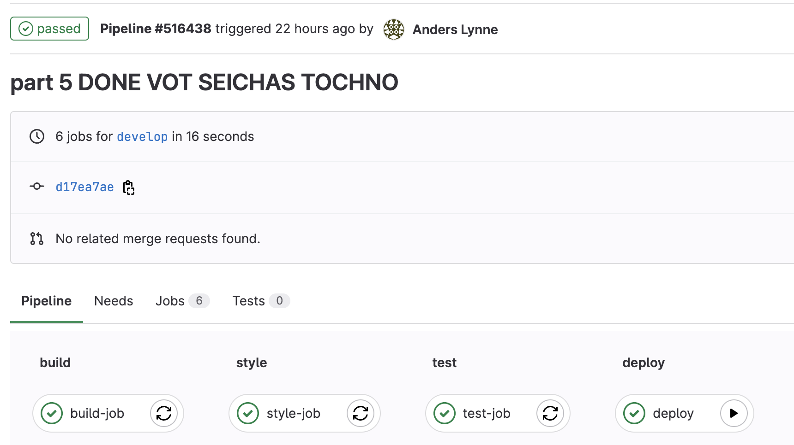

В результате ты должен получить готовые к работе приложения из проекта *C2_SimpleBashUtils* (s21_cat и s21_grep) на второй виртуальной машине.

### Part 6. Дополнительно. Уведомления

##### Настроим уведомления об успешном/неуспешном выполнении пайплайна через бота с именем «[nickname] DO6 CI/CD» в *Telegram*.

Создали бот через следующий бот: 


Создаем скрип telegram.sh (берем пример из materials)
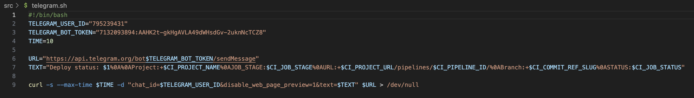

Добавляем после каждого этапа в gitlab-ci.yml   
```
after_script: 
    bash src/telegram.sh 
```
Пушим изменения и проверяем, приходят ли уведомления

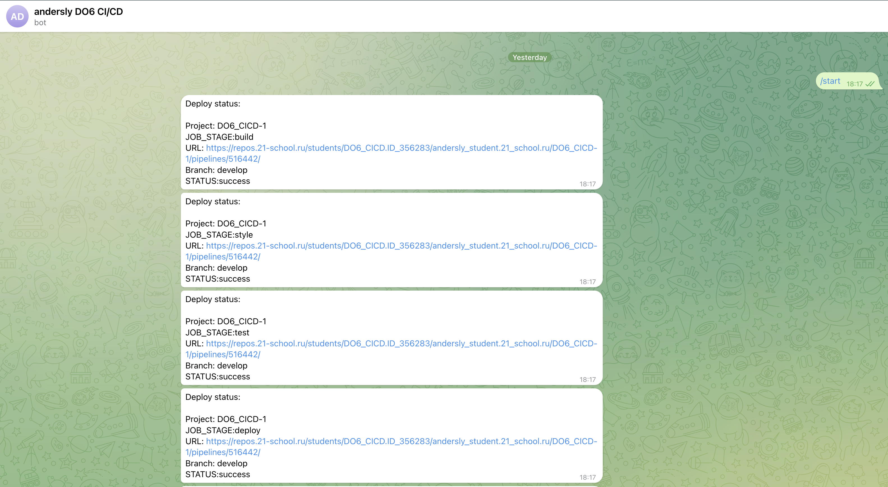

Меняем скрипт деплоя и смотрим, придет ли уведомление с fail'ом

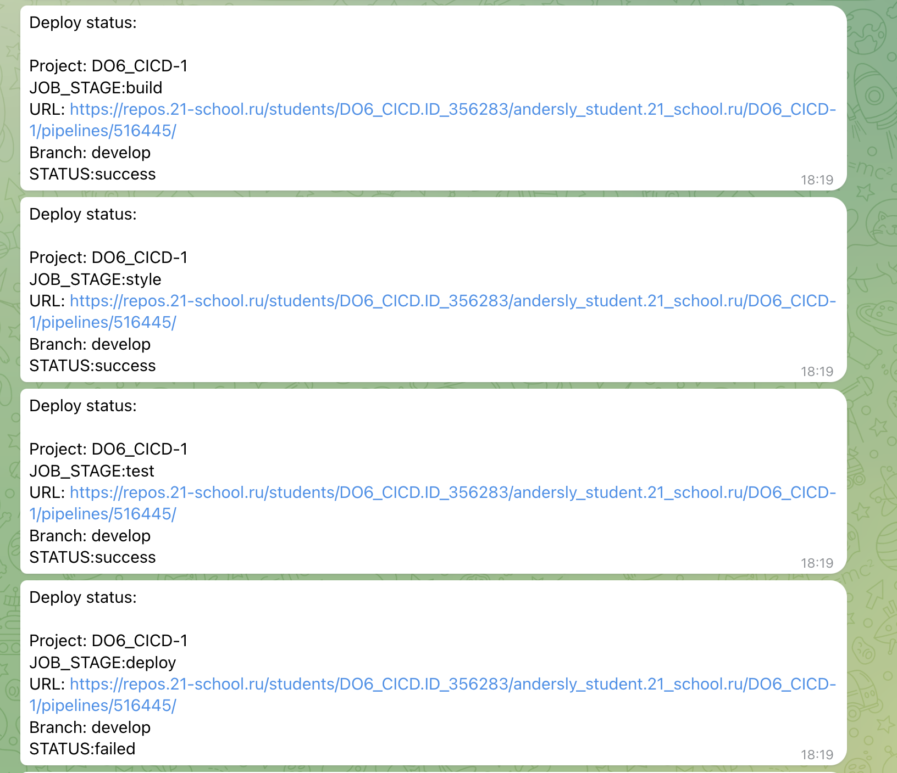


